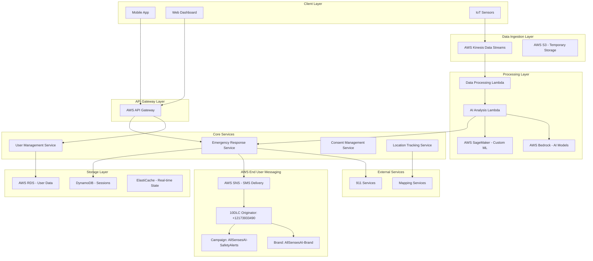
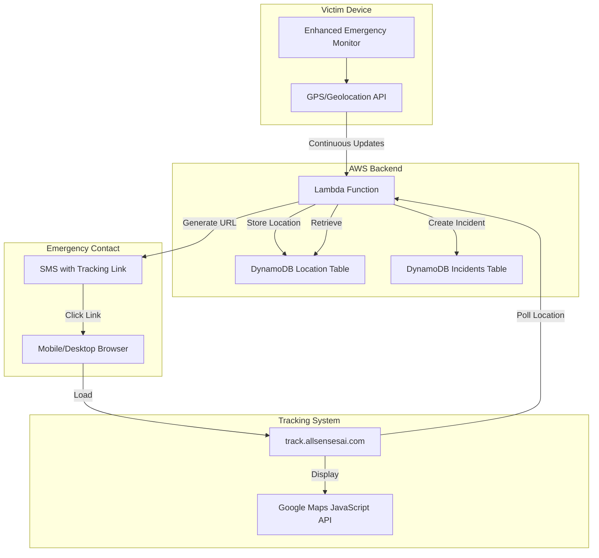

# AllSenses AI Guardian - Design Document

## Overview

AllSenses is designed as a cloud-native, event-driven AI safety platform that processes multimodal sensor data in real-time to detect and respond to emergency situations. The system follows a microservices architecture with clear separation between data ingestion, AI processing, emergency response, and user management components.

The platform leverages AWS managed services for scalability and reliability while maintaining a privacy-first approach through encryption, consent management, and temporary data storage patterns.

## Architecture

### High-Level Architecture



### Technology Stack Integration

The design leverages a modern cloud-native technology stack optimized for real-time AI processing and emergency response:

- **Core Services**: Spring Boot 3.2.0 microservices with Spring Cloud for service discovery and configuration
- **Data Processing**: AWS Lambda functions and Kinesis for real-time stream processing
- **AI/ML**: AWS Bedrock for foundation models, SageMaker for custom threat detection models
- **Storage**: PostgreSQL on RDS (structured data), DynamoDB (sessions), ElastiCache Redis (real-time state)
- **Frontend**: Progressive Web App (PWA) using HTML5/CSS3/Vanilla JavaScript with offline capabilities
- **Infrastructure**: AWS CloudFormation for Infrastructure as Code, Docker for containerization

## Components and Interfaces

### 1. Data Ingestion Service

**Purpose**: Collect and preprocess multimodal sensor data from various sources.

**Key Interfaces**:
```java
@RestController
public class DataIngestionController {
    @PostMapping("/api/v1/sensors/audio")
    ResponseEntity<Void> ingestAudioData(@RequestBody AudioDataRequest request);
    
    @PostMapping("/api/v1/sensors/motion")
    ResponseEntity<Void> ingestMotionData(@RequestBody MotionDataRequest request);
    
    @PostMapping("/api/v1/sensors/environmental")
    ResponseEntity<Void> ingestEnvironmentalData(@RequestBody EnvironmentalDataRequest request);
}
```

**Responsibilities**:
- Validate incoming sensor data
- Apply initial filtering and normalization
- Route data to appropriate processing streams
- Maintain data lineage for privacy compliance

### 2. AI Analysis Engine

**Purpose**: Process multimodal data streams to detect potential threats and distress signals.

**Key Components**:
- **Threat Detection Pipeline**: Analyzes patterns across audio, motion, and environmental data
- **Confidence Scoring**: Assigns probability scores to potential threats
- **Context Correlation**: Combines multiple data sources for comprehensive threat assessment
- **Model Management**: Handles deployment and versioning of AI models

**Integration Points**:
- AWS Bedrock for foundation model inference
- AWS SageMaker for custom threat detection models
- Real-time streaming through Kinesis Data Analytics

### 3. Emergency Response Service

**Purpose**: Orchestrate emergency response workflows when threats are confirmed, using compliant SMS delivery.

**Key Interfaces**:
```java
@Service
public class EmergencyResponseService {
    public EmergencyResponse processEmergencyAlert(ThreatAssessment threat);
    public void contactEmergencyServices(EmergencyContext context);
    public SmsDeliveryResult notifyTrustedContacts(List<Contact> contacts, EmergencyContext context);
    public void trackEmergencyResolution(String emergencyId);
}

@Service
public class CompliantSmsService {
    private static final String ORIGINATOR_NUMBER = "+12173933490";
    private static final String BRAND_ID = "AllSensesAI-Brand";
    private static final String CAMPAIGN_ID = "AllSensesAI-SafetyAlerts";
    
    public SmsDeliveryResult sendEmergencySms(String recipientNumber, EmergencySmsPayload payload);
    public boolean validateComplianceStatus();
    public SmsMessageId getDeliveryConfirmation(String messageId);
}
```

**Responsibilities**:
- Validate threat confidence levels against thresholds
- Coordinate simultaneous contact with 911 and trusted contacts
- Send compliant SMS messages using registered 10DLC originator number
- Manage emergency context data transmission with victim name, location, and incident details
- Track emergency resolution and cleanup
- Validate SMS compliance status before message delivery
- Provide SMS MessageId confirmation for audit trails

### 4. User Management Service

**Purpose**: Handle user registration, consent management, and privacy controls.

**Key Features**:
- Consent lifecycle management
- Trusted contact configuration
- Privacy preference enforcement
- User authentication and authorization

### 5. Location Tracking Service

**Purpose**: Provide precise location data for emergency response.

**Key Capabilities**:
- GPS coordinate processing with accuracy validation
- Location history for context (with privacy controls)
- Integration with mapping services for address resolution
- Geofencing for location-based threat assessment

### 6. Enhanced Emergency Detection System with Compliant SMS

**Purpose**: Provide dual detection capabilities with real-time visual feedback and compliant SMS delivery for comprehensive emergency monitoring.

**Key Components**:
- **Visual Listening Indicator**: Real-time status display showing active monitoring state
- **Emergency Words Detection**: Continuous speech recognition for emergency keywords
- **Abrupt Noise Detection**: Real-time audio analysis for sudden volume spikes
- **Compliant SMS Notifications**: AWS End User Messaging integration using registered 10DLC originator
- **SMS Delivery Confirmation**: MessageId tracking for audit compliance

**Key Interfaces**:
```javascript
class EnhancedEmergencyMonitor {
    // Detection and monitoring
    startContinuousMonitoring();
    updateListeningIndicator(active, status);
    checkEmergencyWords(transcript);
    detectAbruptNoise(volumeLevel);
    
    // Compliant SMS delivery
    sendCompliantEmergencySms(type, data);
    formatSmsPayload(victimName, detectionType, location, incidentId);
    displaySmsConfirmation(messageId);
    displayEmergencyAlert(alertData);
}

// SMS Payload Structure
interface EmergencySmsPayload {
    victimName: string;
    detectionType: 'emergency_words' | 'abrupt_noise';
    dangerStatus: 'CRITICAL' | 'HIGH' | 'MEDIUM';
    geolocationLink: string;
    incidentId: string;
    timestamp: string;
    originatorNumber: '+12173933490';
}
```

**Technical Implementation**:
- **Web Speech API**: Continuous speech recognition for emergency word detection
- **Web Audio API**: Real-time audio analysis for volume threshold monitoring
- **AWS Lambda Integration**: Direct function URL calls for immediate SMS sending via registered originator
- **AWS SNS with 10DLC**: Compliant SMS delivery using Brand (AllSensesAI-Brand) and Campaign (AllSensesAI-SafetyAlerts)
- **Visual Feedback System**: Professional emergency UI with status indicators, alerts, and SMS confirmation display
- **Compliance Validation**: Pre-send validation of brand, campaign, and originator number status

## Data Models

### Core Entities

```java
@Entity
public class User {
    @Id
    private String userId;
    private String email;
    private ConsentStatus consentStatus;
    private List<TrustedContact> trustedContacts;
    private PrivacyPreferences privacySettings;
    private LocalDateTime consentTimestamp;
}

@Entity
public class ThreatAssessment {
    @Id
    private String assessmentId;
    private String userId;
    private ThreatLevel threatLevel;
    private Double confidenceScore;
    private List<SensorReading> sensorData;
    private LocationData location;
    private LocalDateTime timestamp;
    private AssessmentStatus status;
}

@Entity
public class EmergencyEvent {
    @Id
    private String eventId;
    private String userId;
    private ThreatAssessment initialAssessment;
    private List<ResponseAction> responseActions;
    private EventStatus status;
    private LocalDateTime createdAt;
    private LocalDateTime resolvedAt;
}
```

### Privacy-Compliant Data Handling

- **Encryption**: All PII encrypted at rest using AES-256
- **Temporary Storage**: Voice samples and sensor data automatically purged after emergency resolution
- **Consent Tracking**: Immutable audit trail of consent changes
- **Data Minimization**: Only collect and retain data necessary for safety functions

## Error Handling

### Fault Tolerance Strategy

1. **Circuit Breaker Pattern**: Prevent cascade failures in AI processing pipeline
2. **Graceful Degradation**: Continue basic monitoring if advanced AI features fail
3. **Retry Logic**: Exponential backoff for transient failures in emergency services
4. **Fallback Mechanisms**: Alternative communication channels if primary services fail

### Error Categories and Responses

- **Sensor Data Errors**: Log and continue with available sensors
- **AI Processing Failures**: Fall back to rule-based threat detection
- **Emergency Service Failures**: Attempt alternative contact methods
- **Privacy Violations**: Immediate data purge and user notification

### Monitoring and Alerting

```java
@Component
public class SystemHealthMonitor {
    public void monitorAIProcessingLatency();
    public void trackEmergencyResponseTimes();
    public void validateDataPrivacyCompliance();
    public void alertOnSystemAnomalies();
}
```

## Testing Strategy

### Testing Pyramid

1. **Unit Tests**: Core business logic, data models, and service methods
2. **Integration Tests**: API endpoints, database interactions, and external service integrations
3. **End-to-End Tests**: Complete emergency response workflows
4. **Performance Tests**: Load testing for real-time data processing
5. **Security Tests**: Privacy compliance and data protection validation

### Test Data Management

- **Synthetic Data**: Generate realistic but non-personal sensor data for testing
- **Mock Services**: Simulate emergency services and external APIs
- **Privacy Testing**: Validate data encryption and automatic deletion
- **Consent Testing**: Verify consent workflow compliance

### Specialized Testing Requirements

- **AI Model Testing**: Validate threat detection accuracy and false positive rates
- **Emergency Simulation**: Test complete response workflows without triggering real emergency services
- **Multi-Modal Testing**: Verify correlation across different sensor types
- **Regional Testing**: Validate adaptation to different emergency service protocols

### Continuous Testing

- **Automated Regression**: Run full test suite on every deployment
- **Canary Testing**: Gradual rollout of AI model updates
- **A/B Testing**: Compare threat detection algorithms for accuracy improvements
- **Compliance Testing**: Regular validation of privacy and consent requirements

## Enhanced Emergency Detection Architecture

### Dual Detection System Design

The enhanced system implements two parallel detection mechanisms for comprehensive emergency monitoring:

#### 1. Emergency Words Detection System
```javascript
// Continuous speech recognition implementation
const recognition = new SpeechRecognition();
recognition.continuous = true;
recognition.interimResults = true;

recognition.onresult = function(event) {
    const transcript = getTranscript(event);
    checkEmergencyWords(transcript.toLowerCase());
};

function checkEmergencyWords(transcript) {
    const emergencyKeywords = ['help', 'emergency', 'danger', '911', 'fire', 'police'];
    const detectedWords = emergencyKeywords.filter(word => transcript.includes(word));
    
    if (detectedWords.length > 0) {
        triggerEmergencyDetection('emergency_words', {
            detectedWords: detectedWords,
            transcript: transcript
        });
    }
}
```

#### 2. Abrupt Noise Detection System
```javascript
// Real-time audio analysis implementation
function monitorAudioLevels() {
    analyser.getByteFrequencyData(dataArray);
    const currentVolume = calculateVolume(dataArray);
    
    updateVolumeDisplay(currentVolume);
    
    if (currentVolume > noiseThreshold) {
        detectAbruptNoise(currentVolume);
    }
}

function detectAbruptNoise(volume) {
    if (volume > noiseThreshold + 10) {
        triggerEmergencyDetection('abrupt_noise', {
            volume: volume,
            threshold: noiseThreshold
        });
    }
}
```

#### 3. Visual Feedback System
```javascript
// Visual listening indicator implementation
function updateListeningIndicator(active, text) {
    const indicator = document.getElementById('listeningIndicator');
    const textElement = document.getElementById('listeningText');
    
    if (active) {
        indicator.classList.add('active'); // Pulsing animation
    } else {
        indicator.classList.remove('active');
    }
    
    textElement.textContent = text;
}
```

#### 4. Compliant Emergency SMS Integration
```javascript
// AWS Lambda integration for compliant 10DLC SMS delivery
async function sendCompliantEmergencySms(type, data) {
    const smsPayload = {
        action: 'SEND_EMERGENCY_SMS',
        originatorNumber: '+12173933490',  // Registered 10DLC number
        recipientNumber: contactInfo.phone,
        victimName: data.victimName,
        detectionType: type,
        dangerStatus: calculateDangerStatus(type, data),
        geolocationLink: generateGeolocationLink(data.location),
        incidentId: generateIncidentId(),
        timestamp: new Date().toISOString(),
        brandId: 'AllSensesAI-Brand',
        campaignId: 'AllSensesAI-SafetyAlerts'
    };
    
    const response = await fetch(LAMBDA_FUNCTION_URL, {
        method: 'POST',
        headers: { 'Content-Type': 'application/json' },
        body: JSON.stringify(smsPayload)
    });
    
    const result = await response.json();
    
    // Display SMS delivery confirmation
    if (result.smsMessageId) {
        displaySmsConfirmation({
            messageId: result.smsMessageId,
            status: 'DELIVERED',
            originatorNumber: '+12173933490',
            timestamp: result.timestamp
        });
    }
}

// Format compliant SMS message
function formatCompliantSmsMessage(payload) {
    return `🚨 EMERGENCY ALERT
Victim: ${payload.victimName}
Detection: ${payload.detectionType}
Status: ${payload.dangerStatus}
Location: ${payload.geolocationLink}
Incident: ${payload.incidentId}
Time: ${payload.timestamp}

From: AllSensesAI Guardian (+12173933490)`;
}
```

### Enhanced System Components

#### Visual Listening Indicator
- **Fixed position indicator** in top-right corner
- **Pulsing animation** when actively monitoring
- **Real-time status text** updates
- **Color-coded feedback** (green active, gray inactive)

#### Emergency Alert System
- **Full-screen emergency overlay** when threats detected
- **Professional emergency messaging** with incident details
- **Action buttons** for confirmation or cancellation
- **Visual emergency animations** for immediate attention

#### Dual Detection Coordination
- **Parallel monitoring** of both speech and audio levels
- **Independent triggering** - either system can activate emergency response
- **Consolidated notifications** to prevent message flooding
- **Shared visual feedback** system for unified user experience

### Integration with AWS Architecture and SMS Compliance

The enhanced detection system integrates seamlessly with AWS infrastructure and compliant SMS delivery:

#### AWS Infrastructure Components
- **Lambda Function**: Uses validated `AllSenses-Live-MVP-AllSensesFunction-ufWarJQ6FVRk`
- **SNS Integration**: Real SMS sending via `AllSenses-Live-MVP-AlertTopic-3WAmu8OfmjHr`
- **DynamoDB Logging**: Emergency events stored in `AllSenses-Live-MVP-DataTable-1JGAWXA3I5IUK`
- **Bedrock AI**: Threat analysis using Claude-3-Haiku for reasoning
- **IAM Security**: Secure permissions via `AllSenses-Live-MVP-LambdaRole-iHsI1SYbs1Ii`

#### SMS Compliance Components (ACTIVE & OPERATIONAL)
- **Brand Registration**: AllSensesAI-Brand (APPROVED)
  - Status: COMPLETE
  - Verified business identity for compliant messaging
  
- **Campaign Registration**: AllSensesAI-SafetyAlerts (APPROVED)
  - Type: US_TEN_DLC_CAMPAIGN_REGISTRATION
  - Status: COMPLETE
  - Use case: Emergency safety alerts and notifications
  
- **10DLC Originator Number**: +1-217-393-3490 (ACTIVE)
  - Status: Active with SMS capabilities
  - Registered for application-to-person (A2P) messaging
  - Carrier-approved for emergency notification delivery
  
- **AWS End User Messaging**: Fully configured for compliant SMS delivery
  - Integration with AWS SNS for message transmission
  - MessageId tracking for delivery confirmation
  - Audit trail compliance for regulatory requirements

#### SMS Delivery Workflow
1. Emergency detected → Lambda function triggered
2. Compliance validation → Brand, Campaign, Originator verified
3. SMS payload formatted → Victim name, location, incident details
4. AWS SNS transmission → Using registered +12173933490
5. MessageId confirmation → Delivery tracking and audit logging
6. Frontend notification → Display SMS confirmation to user

#### Compliance Validation
```python
def validate_sms_compliance():
    """Validate SMS compliance before sending messages"""
    return {
        'brand_status': 'APPROVED',  # AllSensesAI-Brand
        'campaign_status': 'APPROVED',  # AllSensesAI-SafetyAlerts
        'originator_status': 'ACTIVE',  # +12173933490
        'sms_capability': True,
        'compliance_ready': True
    }
```

## Real-Time Google Maps Live Location Tracking

### Architecture Overview

The live tracking system provides real-time location updates to emergency responders through a web-based Google Maps interface, requiring no special permissions or account linking.



### Location Tracking Data Flow

#### 1. Emergency Detection & Incident Creation
```javascript
// Frontend detects emergency
async function sendEmergencyAlert(type, data) {
    const response = await fetch(LAMBDA_URL, {
        method: 'POST',
        body: JSON.stringify({
            action: 'JURY_EMERGENCY_ALERT',
            victimName: victimName,
            phoneNumber: emergencyPhone,
            location: {
                latitude: position.coords.latitude,
                longitude: position.coords.longitude,
                accuracy: position.coords.accuracy
            }
        })
    });
    
    const result = await response.json();
    
    // Start continuous location tracking
    startLocationTracking(result.incidentId);
    
    // SMS sent with tracking URL: track.allsensesai.com?incident=EMG-ABC123
}
```

#### 2. Continuous Location Updates
```javascript
// Frontend sends location updates every 10 seconds
function startLocationTracking(incidentId) {
    const watchId = navigator.geolocation.watchPosition(
        (position) => {
            sendLocationUpdate(incidentId, {
                latitude: position.coords.latitude,
                longitude: position.coords.longitude,
                accuracy: position.coords.accuracy,
                speed: position.coords.speed,
                heading: position.coords.heading,
                timestamp: position.timestamp
            });
        },
        (error) => console.error("Location error:", error),
        {
            enableHighAccuracy: true,
            maximumAge: 0,
            timeout: 5000
        }
    );
    
    return watchId;
}

async function sendLocationUpdate(incidentId, location) {
    const battery = await getBatteryLevel();
    
    await fetch(LAMBDA_URL, {
        method: 'POST',
        body: JSON.stringify({
            action: 'UPDATE_LOCATION',
            incidentId: incidentId,
            location: location,
            batteryLevel: battery
        })
    });
}
```

#### 3. Backend Location Storage
```python
def handle_update_location(body):
    """Store location update in DynamoDB"""
    incident_id = body.get('incidentId')
    location = body.get('location')
    battery_level = body.get('batteryLevel')
    
    dynamodb = boto3.resource('dynamodb')
    table = dynamodb.Table('AllSenses-LocationTracking')
    
    timestamp = int(datetime.now(timezone.utc).timestamp() * 1000)
    
    table.put_item(
        Item={
            'incidentId': incident_id,
            'timestamp': timestamp,
            'latitude': float(location['latitude']),
            'longitude': float(location['longitude']),
            'accuracy': float(location.get('accuracy', 0)),
            'speed': float(location.get('speed', 0)),
            'heading': float(location.get('heading', 0)),
            'batteryLevel': int(battery_level) if battery_level else None,
            'ttl': int((datetime.now(timezone.utc) + timedelta(hours=24)).timestamp())
        }
    )
    
    return {'status': 'success', 'incidentId': incident_id}
```

#### 4. Tracking Page Real-Time Display
```javascript
// Tracking page polls for latest location every 5 seconds
async function updateLocation() {
    const response = await fetch(LAMBDA_URL, {
        method: 'POST',
        body: JSON.stringify({
            action: 'GET_LOCATION',
            incidentId: incidentId
        })
    });
    
    const data = await response.json();
    
    if (data.location) {
        const position = {
            lat: data.location.latitude,
            lng: data.location.longitude
        };
        
        // Update marker position
        marker.setPosition(position);
        map.panTo(position);
        
        // Add to movement trail
        locationHistory.push(position);
        polyline.setPath(locationHistory);
        
        // Update accuracy circle
        accuracyCircle.setCenter(position);
        accuracyCircle.setRadius(data.location.accuracy);
        
        // Update info panel
        updateInfoPanel(data.location);
    }
}

// Poll every 5 seconds
setInterval(updateLocation, 5000);
```

### DynamoDB Table Structures

#### Location Tracking Table
```
Table: AllSenses-LocationTracking
Partition Key: incidentId (String)
Sort Key: timestamp (Number)

Attributes:
- incidentId: "EMG-ABC123"
- timestamp: 1732627597000 (milliseconds)
- latitude: 25.7617
- longitude: -80.1918
- accuracy: 10.5 (meters)
- speed: 5.2 (m/s, optional)
- heading: 180 (degrees, optional)
- batteryLevel: 75 (percentage, optional)
- ttl: 1732713997 (auto-delete after 24 hours)
```

#### Incidents Table
```
Table: AllSenses-Incidents
Partition Key: incidentId (String)

Attributes:
- incidentId: "EMG-ABC123"
- victimName: "John Doe"
- emergencyPhone: "+13053033060"
- detectionType: "emergency_words"
- initialLocation: { lat, lon, placeName }
- createdAt: "2024-11-26T14:32:15Z"
- status: "active"
- ttl: 1732713997 (auto-delete after 7 days)
```

### Tracking Page Implementation

#### Key Features
- **Google Maps Integration**: Uses Google Maps JavaScript API for familiar interface
- **Real-Time Updates**: Polls backend every 5 seconds for latest location
- **Movement Trail**: Displays polyline showing victim's path
- **Accuracy Visualization**: Shows accuracy circle around current position
- **Battery Monitoring**: Displays victim's device battery level
- **Speed Display**: Shows current movement speed
- **Responsive Design**: Works on mobile and desktop browsers
- **No Authentication Required**: Public access via unique incident ID

#### Hosting Options
1. **S3 + CloudFront** (Recommended): Static hosting with CDN
2. **API Gateway + S3**: Serverless hosting with custom domain
3. **GitHub Pages**: Free hosting for testing/demo
4. **Local Server**: For development and testing

### SMS Message Format with Live Tracking

```
🚨 EMERGENCY ALERT: John Doe is in DANGER!
Emergency words detected: help, emergency

LIVE TRACKING:
https://track.allsensesai.com?incident=EMG-ABC123

Initial Location: Miami Convention Center, FL

Incident: EMG-ABC123
Time: 14:32:15

From: AllSensesAI Guardian (+12173933490)
```

### Privacy & Security Considerations

- **Automatic Data Deletion**: DynamoDB TTL deletes location data after 24 hours
- **Unique Incident IDs**: Prevents unauthorized access to tracking data
- **HTTPS Only**: All communication encrypted in transit
- **No Account Required**: Responders don't need Google accounts
- **Minimal Data Storage**: Only essential location data stored
- **Consent-Based**: Tracking only active during emergencies with user consent

### Performance Characteristics

- **Location Update Frequency**: Every 10 seconds from victim device
- **Map Refresh Rate**: Every 5 seconds on tracking page
- **Latency**: < 2 seconds from GPS reading to map display
- **Accuracy**: Typically 5-20 meters with high-accuracy GPS
- **Battery Impact**: Optimized for emergency duration (< 1 hour typical)
- **Cost**: ~$0.005 per emergency (DynamoDB + Lambda)

### Fallback Mechanisms

1. **Google Maps API Failure**: Display coordinates and static map link
2. **Location Update Failure**: Show last known position with timestamp
3. **Network Interruption**: Queue updates and send when reconnected
4. **GPS Unavailable**: Fall back to network-based location (lower accuracy)